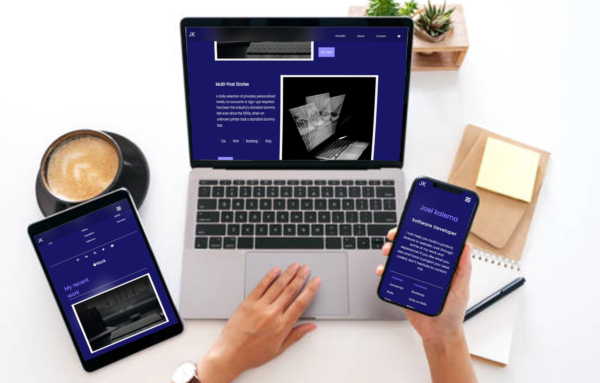

# Portfolio

> My personal portfolio is a responsive web app that I used to present my skills, projects and other details about myself. It also contains a form that can be used to reach out to me directly.

## Built With

- Html
- Css
- Js

## Live Demo

 Click [here](https://joel-kalema.github.io/Portfolio/)!

## Getting Started

To get a local copy up and running follow these simple example steps.

1. Download the zip file or clone with this command `git clone git@github.com:joel-kalema/Mobile-version-skeleton.git`(Make sure you have `Git installed` in your Computer or Install it by following [these steps](https://git-scm.com/book/en/v2/Getting-Started-Installing-Git))
2. `cd Mobile-version-skeleton`
3. Open it with the live server

Set-up ESLint in your local env:
-Run `npm install --save-dev eslint@7.x eslint-config-airbnb-base@14.x eslint-plugin-import@2.x babel-eslint@10.x`
-Copy [.eslintrc.json](https://github.com/microverseinc/linters-config/blob/master/html-css-js/.eslintrc.json) to the root directory of your project.
-Do not make any changes in config files - they represent style guidelines that you share with your team - which is a group of all Microverse students.
-Run `npx eslint .` on the root of your directory of your project.
-Fix linter errors.

## Author

- GitHub: [@joel-kalema](https://github.com/joel-kalema)
- Twitter: [@JoelJklm](https://twitter.com/JoelJklm)
- LinkedIn: [joel kalema](https://www.linkedin.com/in/joel-kalema-30518a230/)

## 🤝 Contributing

Contributions, issues, and feature requests are welcome!

Feel free to check the [issues page](https://github.com/joel-kalema/Mobile-version-skeleton/issues).

## Show your support

Give a ⭐️ if you like this project!

## Acknowledgments

- Hat tip to anyone whose code was used
- Inspiration
- etc

## 📝 License

This project is [MIT](./MIT.md) licensed.
